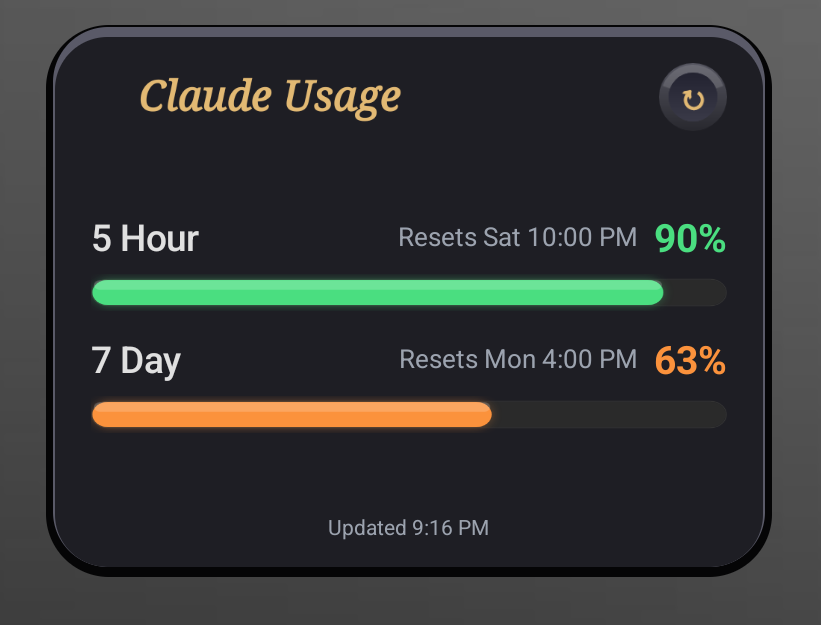
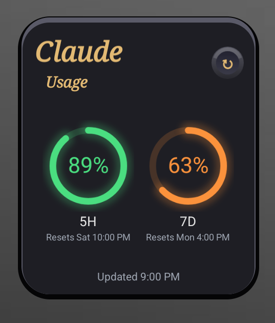

# Claude Usage Widget

A native Android app that adds a home screen widget showing your Claude.ai usage limits at a glance — without opening any app.

> **Platform availability:** Android only for now. iOS support is planned but not yet available as it requires an Apple Developer account.

---

## Widgets

<table align="center" border="0" cellspacing="0" cellpadding="16">
  <tr>
    <td align="center">
      
      <br/><sub><b>Medium (4×2) — Progress Bars</b></sub>
    </td>
    <td align="center">
      
      <br/><sub><b>Small (2×2) — Circular Dials</b></sub>
    </td>
  </tr>
</table>

---

## Features

- **Auto-refresh** — Updates every 15 minutes in the background
- **Color-coded** — Green (low), orange (medium) usage indicators
- **Reset timers** — Shows exactly when your limits reset
- **Tap to refresh** — Manual refresh button on the widget
- **Secure** — Session cookie stored encrypted on-device, never leaves your phone

---

## Installation

### Option 1: Download APK (easiest)

1. Go to the [Releases](../../releases) page and download the latest `app-release.apk`
2. On your Android phone, open **Settings → Apps → Special app access → Install unknown apps** and allow your browser or file manager to install APKs
3. Open the downloaded APK and tap **Install**

> **Note:** Android may warn that the app is from an unknown source. This is expected for any APK installed outside the Play Store. The app is completely safe open source — you can review every line of code in this repo.

### Option 2: Build from source

```bash
git clone https://github.com/StefanosKontopoulos/claude-widget.git
cd claude-widget/android
./gradlew assembleDebug        # macOS / Linux
gradlew assembleDebug          # Windows
```

Install the APK from `app/build/outputs/apk/debug/app-debug.apk`

---

## Setup

### 1. Sign in

Open the app and tap **Sign in to Claude**. A login page will appear.

> **Important:** When the cookie consent prompt appears, tap **Allow** (or **Accept**). The app uses your browser session cookie to read your usage data — this prompt is part of how that works. If you dismiss it, **! the login will not complete !**

### 2. Add the widget

1. Long-press on your home screen
2. Tap **Widgets**
3. Search for **Claude Widget**
4. Long-press and drag it to your home screen

---

## Security

Your data never leaves your device:

- The session cookie is stored **encrypted on-device** using AES-256 encryption
- The app makes requests **only to `claude.ai`** — no third-party servers, no analytics, no tracking
- You can sign out at any time from the app, which wipes all stored credentials immediately

---

## Troubleshooting

**Widget not updating after login or logout?**  
Give it a few seconds — the widget re-renders automatically. If it still looks stuck, remove the widget from your home screen and add it again.

**Found a bug?**  
Please [open an issue on GitHub](../../issues) with a description of what happened and your Android version. This helps a lot.

---

## Requirements

- Android 8.0 (API 26) or higher
- A Claude.ai account

---

## License

MIT License — see [LICENSE](LICENSE)
